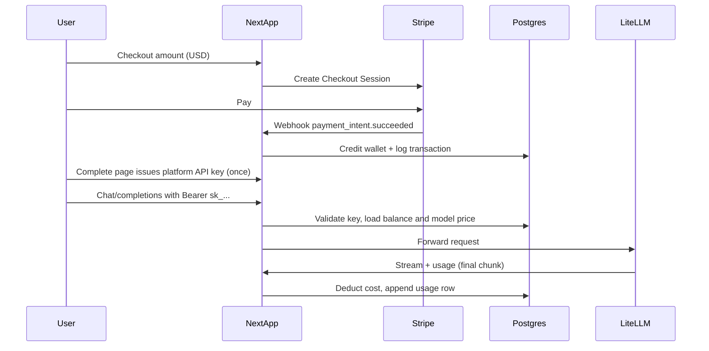

# Prepaid Stripe billing, platform API keys, and token metering

## Money columns: `balance_cents` vs `amount_cents`

- **`balance_cents`** (e.g. on `user_wallets`): the user’s **current prepaid balance** in your canonical smallest unit (e.g. USD cents). Increases on Stripe-confirmed top-ups; decreases on usage debits.
- **`amount_cents`** (e.g. on `billing_transactions`): the **amount of one Stripe payment** (one top-up). Historical, idempotent on payment intent / session id—not the running balance.

Together: audit trail from transactions + debits should reconcile with `balance_cents` if you maintain a full ledger.

---

## `models` table: pricing columns (not yet migrated)

Add to the existing **`models`** table:

| Column | Purpose |
|--------|--------|
| `input_price_per_million_cents` | Integer. Platform cost per **1M prompt tokens** (cents). |
| `output_price_per_million_cents` | Integer. Platform cost per **1M completion tokens** (cents). |

**Billing (conceptual):**  
`cost_cents = ceil((prompt_tokens / 1_000_000) * input_price_per_million_cents + (completion_tokens / 1_000_000) * output_price_per_million_cents)` — use integer math; define rounding in implementation.

---

## `user_api_keys`: platform vs legacy (`key_type`)

**Done in migration 00009:** `key_type TEXT NOT NULL` with `CHECK (key_type IN ('platform', 'legacy'))`. Other columns unchanged (`id`, `user_id`, `key_hash`, `key_prefix`, `name`, `last_used_at`, `created_at`, `provider_id` from 00008).

| Value | Meaning |
|-------|--------|
| **`platform`** | Silk-issued gateway key; prepaid metering; **`provider_id` IS NULL**. |
| **`legacy`** | Old BYOK rows; user-stored provider key; **`provider_id` IS NOT NULL**. |

Backfill: `provider_id IS NOT NULL` → `legacy`, else → `platform`. Optional later: `revoked_at` for platform keys.

---

## Usage: `api_usage_events` only (`api_usage` removed)

**Decision:** No aggregate `api_usage` table—it is **dropped** after one-time migration into **`api_usage_events`**.

### What migration 00009 did

File: [`supabase/migrations/00009_key_type_and_usage_events.sql`](supabase/migrations/00009_key_type_and_usage_events.sql)

- Created **`api_usage_events`** with: `user_id`, `model_id`, `api_key_id`, `prompt_tokens`, `completion_tokens`, `cost_cents`, `source` (`live` \| `migrated_rollup`), `rollup_request_count`, `legacy_first_used_at`, `created_at`.
- Migrated each **`api_usage`** row to one **`migrated_rollup`** row (tokens/cost 0; `rollup_request_count` = old `request_count`).
- Dropped **`api_usage`** and **`increment_usage_count()`**.
- RLS: users `SELECT` own rows; `service_role` full for server inserts.

**Prerequisite:** [`00008_api_key_access.sql`](supabase/migrations/00008_api_key_access.sql) applied first (`request_count`, `last_used_at` on `api_usage`).

### App

- [`app/dashboard/page.tsx`](app/dashboard/page.tsx): reads `api_usage_events`, aggregates per `model_id` (`SUM(COALESCE(rollup_request_count, 1))` for requests); legacy keys: `key_type = 'legacy'`.

**Future:** Gateway/sandbox insert **`source = 'live'`** rows with real tokens/cost; metered route replaces ad-hoc rollup logic.

---

## Target architecture



**Why prepaid wallet:** User-chosen upfront amount → **Stripe Checkout → credit `balance_cents`** in Postgres → deduct per call using **reported usage** from LiteLLM/OpenAI. Stripe Metered Billing fits recurring invoices; wallet + ledger fits this UX.

---

## Plan: Using the API key in applications after payment completes

This section is the **end-to-end contract** for “payment done → developer can call Silk from their own codebase.”

### 1) Order of operations (do not show a spendable key before money is real)

1. **Stripe Checkout** completes; user returns to your app (`success_url` with `session_id` optional).
2. **Webhook** `checkout.session.completed` (or `payment_intent.succeeded`) runs **first**: verify signature, idempotently insert **`billing_transactions`**, **`credit_wallet`** for that user. Until this runs, the user should not rely on balance.
3. **Key issuance** happens only after you are confident payment + credit succeeded:
   - **Option A (recommended):** User lands on `/billing/success` (logged in). Server verifies session against Stripe (retrieve Checkout Session) **or** checks `user_id` + a fresh positive wallet balance / completed transaction, then calls the same logic as **`POST /api/keys`** to mint a **platform** key (`key_type = 'platform'`), return **plaintext once** in the HTML or a one-time JSON response.
   - **Option B:** Dashboard button **“Generate API key”** enabled only if `balance_cents > 0` or at least one successful **`billing_transactions`** row for that user.
4. **Never** mint the platform key inside the Stripe webhook alone without tying it to the **authenticated** Supabase user (unless you pass `client_reference_id` / `metadata.supabase_user_id` and validate tightly). Prefer: webhook credits wallet; **browser session** completes the “reveal key” step so you do not email secrets.

### 2) What you store in the database

- **`user_api_keys`**: `key_hash`, `key_prefix`, `key_type = 'platform'`, `user_id`, `provider_id IS NULL`.
- Optionally **`last_used_at`** updated on first successful gateway call (helps support/debug).

### 3) How developers use the key in **their** applications

- **Base URL:** `https://<your-production-domain>` (and a documented staging URL).
- **Endpoint:** `POST /api/v1/chat/completions` (or the path you implement)—**OpenAI-compatible** JSON (`model`, `messages`, optional `max_tokens`, `stream`).
- **Authentication:** `Authorization: Bearer <sk_...>` (same pattern as OpenAI/OpenRouter).
- **Model identifier:** Use a **stable id** you document (e.g. Silk model **slug** or internal id), not an arbitrary upstream string; your gateway maps it to `litellm_model_id` and allowlists it.

**Example (server-side Node):**

```http
POST /api/v1/chat/completions
Authorization: Bearer sk_...
Content-Type: application/json

{
  "model": "gemini-3-flash-preview",
  "messages": [{ "role": "user", "content": "Hello" }],
  "stream": false
}
```

- **Secrets in customer apps:** Store the key in **environment variables** (e.g. `SILK_API_KEY`), not in client-side bundles. If they must call from a browser, use a **backend-for-frontend** proxy; do not expose `sk_` in the browser.

### 4) What your gateway must do on each request

1. Parse `Authorization`, hash lookup in **`user_api_keys`** for `key_type = 'platform'`.
2. Load **`user_wallets.balance_cents`**; reject with **402** if below minimum for the request.
3. Resolve model + pricing; forward to LiteLLM; read **`usage`**; compute cost; **`debit`** + append **`api_usage_events`** (`source = 'live'`).

### 5) UX and docs to ship alongside

- **“Copy key once”** UI with warning that it cannot be shown again (align with [`user_api_keys`](supabase/migrations/00002_create_tables.sql) hash-only storage).
- Short **API reference** page: base URL, auth header, model list, errors (401 invalid key, 402 insufficient balance, 429 rate limit).
- Optional: **key rotation** (revoke old hash, issue new)—plan as a follow-up.

### 6) Relationship to this repo today

- Metered **`POST /api/v1/chat/completions`** and Stripe flows are **not implemented yet**; this section is the target behavior once those todos are done.

---

## Current baseline (code)

- Cart + [`app/api/purchases/route.ts`](app/api/purchases/route.ts): BYOK; no Stripe.
- [`app/api/sandbox/chat/route.ts`](app/api/sandbox/chat/route.ts): session sandbox; no balance metering; **does not yet** insert `api_usage_events`.
- Product direction: **replace BYOK** with prepaid + platform key.

---

## Remaining work

### 1) Database (next migrations)

- **`user_wallets`**: `user_id` PK, `balance_cents`, `updated_at`.
- **`billing_transactions`**: `user_id`, unique `stripe_payment_intent_id`, `amount_cents`, `type` (`topup`), `created_at`.
- **`models`**: `input_price_per_million_cents`, `output_price_per_million_cents`.
- **SECURITY DEFINER** RPCs: `credit_wallet`, `debit_usage` (or equivalent); RLS so users cannot tamper with balances.

Ledger for usage remains **`api_usage_events`** only.

### 2) Stripe

- Dependency: `stripe` SDK.
- Env: `STRIPE_SECRET_KEY`, `STRIPE_WEBHOOK_SECRET`, optional publishable key, success/cancel URLs.
- `POST /api/billing/checkout` — authenticated, `{ amountCents, currency }` → Checkout Session.
- `POST /api/webhooks/stripe` — verify signature → idempotent credit + `billing_transactions` row.

### 3) Platform keys + cut BYOK UI

- `POST /api/keys` — mint `sk_...`, hash storage, plaintext once, `key_type = 'platform'`.
- Remove/replace: [`components/cart/CartDrawer.tsx`](components/cart/CartDrawer.tsx), [`AddToCartButton.tsx`](components/cart/AddToCartButton.tsx), [`context/CartContext.tsx`](context/CartContext.tsx), [`app/api/purchases/route.ts`](app/api/purchases/route.ts).

### 4) Metered gateway

- `POST /api/v1/chat/completions` (or equivalent): Bearer platform key → validate → balance check → LiteLLM → parse `usage` → insert **`api_usage_events`** (`live`) → debit wallet.

**Sandbox:** free vs metered — document or env-flag.

### 5) Dashboard

- Balance + top-ups: pending Stripe.
- Per-model usage: already aggregates **`api_usage_events`**; add tokens/cost columns when billing populates them.

### 6) Security

- Never expose `SUPABASE_SERVICE_ROLE_KEY` to the browser; idempotent webhooks/debits.

---

## Implementation order

1. ~~00009: `key_type`, `api_usage_events`, drop `api_usage`~~ — done (run SQL on Supabase if not applied).
2. Wallet + `billing_transactions` + model pricing columns + RPCs.
3. Stripe checkout + webhook + `.env.example`.
4. Platform key issuance + remove BYOK cart.
5. Billable proxy + live `api_usage_events` + debit.
6. Dashboard balance + enriched usage.
