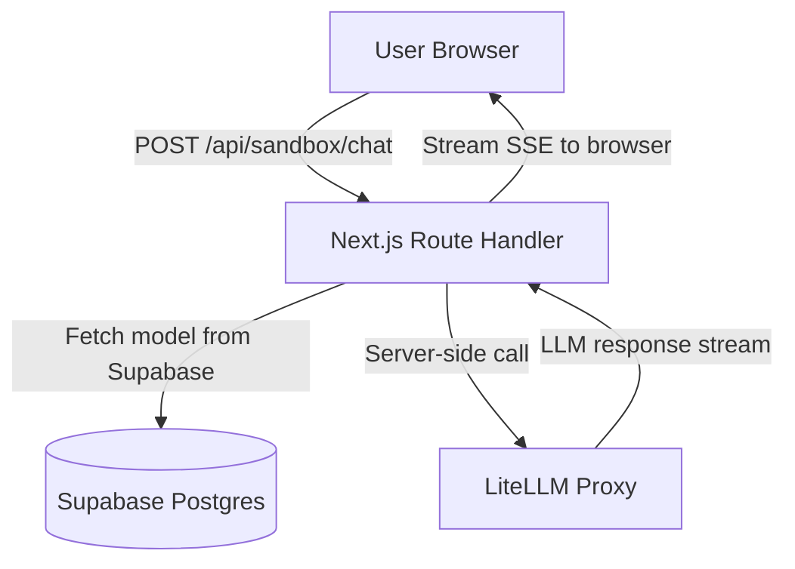

# Sandbox Chat Feature (Secure Ephemeral)

## Goals & UX

- Users open a model page (e.g., `app/models/[slug]/page.tsx`) and click **Try in Sandbox**.
- A sandbox chat page lets them pick the model and send text messages.
- Assistant responses stream back to the browser.
- Chat transcripts are **ephemeral** (not stored in DB), but you can still optionally log lightweight “tried” events for analytics.

## Key Security Principles

- Browser never talks to provider APIs directly.
- Browser never receives provider API keys or the LiteLLM service secret.
- Server validates:
  - modelSlug exists in Supabase
  - user is authenticated
  - modelSlug is allowed for sandbox
  - message count and prompt size
  - rate limits / budgets
- Server calls LiteLLM with platform-held provider keys (in `config.yaml`) and with a private service auth token.

## Architecture & Request Flow

## Implementation Plan

### 1. Add Sandbox UI Route

- Create a new page route:
  - `app/sandbox/[modelSlug]/page.tsx`
- Page responsibilities:
  - Load model list (or use the single model from `[modelSlug]`).
  - Render a chat UI (messages in React state, ephemeral).

UI building blocks (suggested):

- `components/sandbox/Chat.tsx` (client)
- `components/sandbox/MessageList.tsx` (client)

Integrate CTA into model page:

- Update `app/models/[slug]/page.tsx` to add a **Try in Sandbox** link/button near Documentation/Overview.

### 2. Create API Endpoints (Server-only)

#### 2a. List models for sandbox

Option A (simple): reuse your existing model fetching logic server-side.
Option B: create `app/api/sandbox/models/route.ts` that returns:

- `id`, `slug`, `name`, `rank_order`, `api_docs`, `providers.name`, `providers.slug`

(Use your existing patterns from `app/api/models/route.ts` / `app/models/[slug]/page.tsx`.)

#### 2b. Sandbox chat endpoint

Create:

- `app/api/sandbox/chat/route.ts`

Request body (example):

- `modelSlug: string`
- `messages: Array<{ role: 'user'|'assistant'|'system', content: string }>`
- `temperature?: number` (optional)

Server steps:

1. Authenticate user (Supabase auth session via your existing `createClient()` in `lib/supabase/server.ts`).
2. Rate limit (see section 5).
3. Fetch the selected model:
  - Query `models` by `slug` and read `litellm_model_id` and related info.
4. Validate the payload:
  - max number of messages (e.g., last N)
  - max total characters
  - allowed roles
5. Call LiteLLM proxy from the server:
  - Use OpenAI-compatible endpoint (LiteLLM proxy) with `model = litellm_model_id`.
6. Stream response back to the browser as SSE.

### 3. LiteLLM Configuration (Platform-held keys)

Run LiteLLM proxy as a separate service with a `config.yaml` that includes only your sandbox models (initially the 10 in your DB; later you can expand).

Goals for config:

- Allowed model list is explicit (no wildcard “open routing” for arbitrary providers).
- Provider keys come from server environment variables.
- Require LiteLLM auth so only your Next.js service can call it.

Your Next.js server needs:

- `LITELLM_PROXY_URL` (base URL)
- `LITELLM_SERVICE_API_KEY` (service token for LiteLLM proxy auth)

(You already have provider model mappings in `models.litellm_model_id`.)

### 4. Model Resolution & Allowlisting (Prevent “model parameter injection”)

- The browser sends only `modelSlug`.
- The server ignores any client-provided LiteLLM model ID.
- Server reads `models.litellm_model_id` from Supabase and uses that for the LiteLLM call.
- Additionally, you can store a `sandbox_enabled` boolean in DB later if you want to temporarily disable models.

### 5. Rate Limiting & Budgets (Mandatory for sandbox)

Because sandbox chat uses your paid provider keys, protect against abuse.

Minimum protections:

- Per-user + per-IP rate limits (e.g., N requests per minute).
- Cap tokens per request (set LiteLLM/OpenAI params such as `max_tokens`).
- Cap message size.
- Cap total requests per session (in-memory).

Implementation suggestion:

- Add a small server-side rate limiter utility (e.g., using Upstash Redis or in-memory LRU for dev).

### 6. Ephemeral Transcripts Strategy (Persistence = Ephemeral)

- Keep `messages` only in the browser state.
- On each user “send”, send the current conversation (or last N turns) to `POST /api/sandbox/chat`.
- Do not store transcripts in Supabase.

Optional lightweight logging (still not transcripts):

- Increment `api_usage` rows on successful completion.

### 7. Streaming UX

- Prefer streaming responses to reduce perceived latency.
- Implementation approach:
  - Next.js route returns SSE stream.
  - The client app reads the stream and appends text progressively.

(Keep this modular so you can switch to non-streaming if needed.)

### 8. Testing & Verification

- Integration test checklist:
  - Unauthorized users are blocked (401/redirect).
  - Request with invalid `modelSlug` returns 404.
  - Request attempts to force an unsupported model are denied.
  - Rate limiting triggers 429.
  - Streaming works end-to-end.

### 9. Deployment Checklist

- Ensure LiteLLM proxy is reachable from Next.js server.
- Set env vars for:
  - `LITELLM_PROXY_URL`
  - `LITELLM_SERVICE_API_KEY`
- Add health checks.

## Files You’ll Likely Touch

- `app/models/[slug]/page.tsx` (add CTA)
- `app/sandbox/[modelSlug]/page.tsx` (new)
- `app/api/sandbox/chat/route.ts` (new)
- `lib/`* (optional helpers: rate limiting, LiteLLM client, validation)

## Open Questions (assumed defaults)

- Authentication is required for sandbox chat (recommended).
- Streaming is enabled by default; can fall back to non-streaming.
- Token caps are enforced server-side to control spend.

